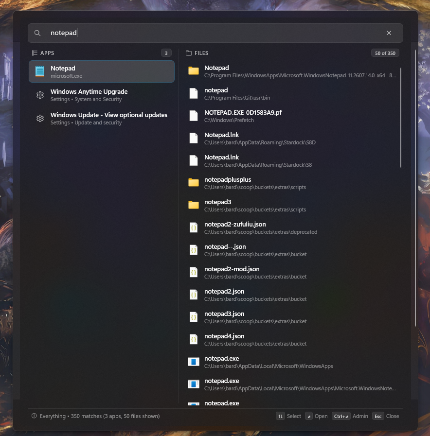
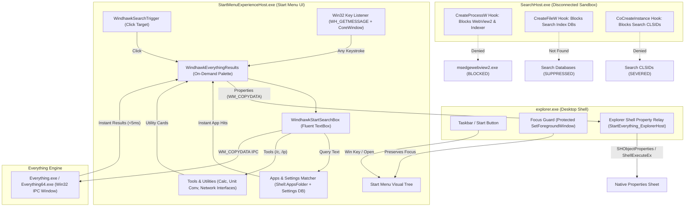

# Everything & Power Tools in the Start Menu

[](https://windhawk.net/)
[](https://www.voidtools.com/)
[](LICENSE)

A high-performance, native replacement for Windows 11 Start Menu search powered directly by voidtools Everything. Completely severs SearchHost background telemetry, Bing web queries, and Edge WebView2 processes, replacing them with instantaneous sub-millisecond local file, application, and settings search directly inside the Start Menu.



---

## Highlights and Key Features

- **Instant voidtools Everything IPC**: Sub-millisecond file querying directly through the Everything Win32 IPC interface. Instant results across millions of files without background indexing lag or disk thrashing.
- **Smart Apps and Windows Settings Search**: Instant fuzzy matching across Desktop applications, Microsoft Store / UWP packages, Control Panel applets, and Windows Settings URIs (`ms-settings:`), with high-resolution shell icons.
- **On-Demand Animated Palette**: The Start Menu stays completely clean and uncluttered when idle. The search palette smoothly reveals with a 140ms ease-out animation the moment you type or click the top search trigger, and collapses on empty or Escape.
- **Complete SearchHost Disconnection**: Intercepts process creation, database access, and COM activation in `SearchHost.exe` to completely eliminate background Bing web queries, Edge WebView2 child processes, and indexing CPU spikes without breaking system stability.
- **Inline Calculator**: Type `/c <expression>` (e.g. `/c 100 * 5`, `/c sqrt(144)`, `/c 15% of 200`, `/c 2^10`) to calculate math on the fly. Press Enter to copy the result directly to your clipboard.
- **Configurable Unit Conversions**: Type `/c <number> [unit]` to run unit conversions driven entirely by formulas defined in Mod Settings. Users can add, edit, or delete conversions item-by-item from the settings UI.
- **Network Interface Inspector**: Type `/ip` to display all active Wi-Fi, Ethernet, and VPN network interfaces with their IP addresses, subnet masks, gateways, and hardware descriptions. Press Enter to copy the IP.
- **Full Right-Click Context Menu**: Right-click any file, folder, or application to Open, Run as Administrator, Open in terminal, Properties, Create desktop shortcut, Cut/Copy (files), Copy path, or Open file location.
- **Explorer Shell Property Relay**: Crosses the AppContainer isolation boundary to display native Windows property sheets hosted directly by `explorer.exe`.
- **Explicit Web Search**: Trigger web searches on demand using the `?` prefix (e.g. `?query`). Includes customizable keyword shortcuts such as `?yt` (YouTube), `?gh` (GitHub), `?w` (Wikipedia), and `?r` (Reddit).
- **Start Menu Styler Compatibility**: Automatically adopts background styles (Tinted Glass, Acrylic, custom theme colors) in real time without needing to restart the mod.
- **Native Win32 Message Routing**: Clean focus management and window message dispatching without thread input attachment or synthetic key hacks.
- **Accidental Open Prevention**: Enter only triggers actions when an item is selected in the active panel, preventing unintended opening of files.

---

## System Architecture



---

## Built-In Commands and Utilities

| Command | Description | Example | Enter Action |
| :--- | :--- | :--- | :--- |
| `/c <expression>` | Inline math calculation | `/c 100 * 5`<br>`/c sqrt(144)`<br>`/c 15% of 200` | Copies calculation result to clipboard |
| `/c <number>` | Runs all configured unit conversions and integer Programmer Radix (Hex, Bin, Oct) | `/c 100`<br>`/c 25` | Copies selected conversion to clipboard |
| `/c <number> <unit>` | Targets a specific source unit | `/c 100 km`<br>`/c 32 c`<br>`/c 50 lbs` | Copies selected conversion to clipboard |
| `/ip` | Lists all active Wi-Fi, Ethernet, and VPN adapters with IP, subnet, gateway, and adapter name | `/ip` | Copies selected IP address to clipboard |
| `?<query>` | Searches the web using the default search engine URL | `?weather today` | Opens search in default web browser |
| `?<shortcut> <query>` | Searches specific service using configured shortcut keyword | `?yt lofi hip hop`<br>`?gh windhawk` | Opens query on target service |

---

## Keyboard Shortcuts and Navigation

| Shortcut / Input | Action |
| :--- | :--- |
| **Type any key** | Automatically reveals the search palette, focuses the search box, and queries apps and files |
| **Click Search Area** | Clicks header trigger area to reveal search palette and focus search box |
| **Up / Down Arrow Keys** | Navigate selection through applications, utility cards, and files |
| **Enter** | Launch selected application, copy calculation/conversion/IP result, or open item |
| **Ctrl + Enter** | Run selected application or file as Administrator (triggers UAC) |
| **Escape** | Clear search text and smoothly collapse search palette back to pinned apps |
| **Right-Click** | Open context menu (Open, Run as administrator, Open in terminal, Properties, Create desktop shortcut, Cut/Copy, Copy path, Open file location) |

---

## Right-Click Context Menu Actions

When right-clicking any file, folder, or application:

- **Open**: Opens the file or launches the application.
- **Run as administrator**: Launches executables, scripts (`.bat`, `.cmd`, `.ps1`), shortcuts (`.lnk`), and management consoles (`.msc`) with elevated administrative privileges.
- **Open in terminal**: *(Folders only)* Flyout submenu with options for **Command Prompt** and **PowerShell**:
  - Left-click launches normally in that folder.
  - Right-click launches elevated as Administrator in that folder.
- **Properties**: Displays the native Windows properties dialog sheet for the file, folder, or application via the Explorer Shell Relay host.
- **Open file location**: Opens the parent folder in File Explorer and selects the target item.
- **Copy path**: Copies the absolute file path as plain text (`CF_UNICODETEXT`). Does not close the Start Menu.
- **Create desktop shortcut**: Instantly creates a `.lnk` shortcut on the user's Desktop for files, folders, Win32 apps, or UWP packages. Existing shortcuts are never overwritten.
- **Cut**: *(Files panel)* Places the file on the Windows clipboard using shell `CF_HDROP` with `DROPEFFECT_MOVE`. Pasting in any File Explorer folder or Desktop moves the file. Does not close the Start Menu.
- **Copy**: *(Files panel)* Places the file on the Windows clipboard using shell `CF_HDROP` with `DROPEFFECT_COPY`. Pasting in any File Explorer folder or Desktop duplicates the file. Does not close the Start Menu.

> [!NOTE]
> **Pinning to Taskbar or Start Menu**:
> In modern Windows 11, Microsoft has strictly restricted programmatic pinning APIs (`Pin to Taskbar` / `Pin to Start`) to internal Windows system processes; third-party software cannot invoke these verbs directly.
> If you wish to pin an item from search results to your Taskbar or Start Menu:
> 1. Right-click the item and select **Create desktop shortcut**.
> 2. Go to your Desktop, right-click the newly created shortcut, and select **Pin to Taskbar** or **Pin to Start**.

---

## Mod Settings and Customization

All settings can be customized in the Windhawk UI under **Everything & Power Tools in the Start Menu** > **Settings**:

- **Max App Results**: Number of application matches displayed in the Apps column (default 6).
- **Max File Results**: Number of file matches displayed in the Files column (default 12).
- **Show Keyboard Shortcuts Bar**: Toggle display of the bottom shortcuts hint bar.
- **Demote Noisy Paths**: Automatically demote deep build caches, version control internals, and temporary directories to the bottom of file search results.
- **Excluded Path Patterns**: Paths matching any configured substrings (e.g. `\node_modules\`, `\.git\`, `\build\`, `\winsxs\`) will be demoted so build artifacts and internal system files do not clutter top matches.
- **Default Search Engine URL**: URL template for web search queries (default DuckDuckGo: `https://duckduckgo.com/?q={q}`).
- **Web Search Shortcuts**: Define custom prefix keywords and target URLs (e.g. `yt` for YouTube, `gh` for GitHub, `w` for Wikipedia, `r` for Reddit).
- **Custom Unit Conversions**: Fully configurable unit conversions for `/c <number> [unit]`. Manage conversion formulas item-by-item:
  - Formulas evaluate using `x` as input (e.g. `x * 0.621371`, `x * 9 / 5 + 32`, `x / 1024`).
  - Delete individual conversions with the remove button on each item.
  - Add new conversion formulas at any time.

---

## How It Works Internally

### 1. High-Performance Win32 IPC
Rather than relying on COM search indexers or external broker daemons, the mod communicates directly with voidtools Everything's `EVERYTHING_IPC_WNDCLASS` hidden window via Win32 `WM_COPYDATA`. Queries execute with sub-millisecond round-trip response times across millions of indexed files.

### 2. Complete SearchHost Disconnection
Rather than hardcoding version-specific DLL byte offsets (which break on cumulative updates) or killing `SearchHost.exe` (which triggers high-CPU restart loops), the mod hooks standard Win32 and COM entry points within `SearchHost.exe`:
- `CreateProcessW`: Denies execution of `msedgewebview2.exe` and `searchindexer.exe`.
- `CreateFileW`: Returns file-not-found for internal search databases (`appsindex.db`, `settings.db`, `windows.edb`).
- `CoCreateInstance`: Denies activation of Windows Search COM CLSIDs.

This ensures SearchHost stays completely quiet: 0% CPU, 0 web requests, and Edge WebView2 processes never spawn.

### 3. Explorer Shell Property Relay
`StartMenuExperienceHost.exe` runs inside an AppContainer sandbox, which restricts loading desktop shell property sheet extensions (`IShellPropSheetExt`). The mod resolves this by injecting into `explorer.exe` (Medium integrity desktop shell) and creating a dedicated STA host window (`StartEverything_ExplorerHost`). When "Properties" is clicked in the Start Menu, a message is securely relayed across the UIPI isolation boundary, allowing `explorer.exe` to launch the native properties dialog sheet cleanly.

### 4. Dynamic Theme and Acrylic Synchronization
When using Windhawk's Windows 11 Start Menu Styler or custom system themes:
- **Visual Tree Re-attachment**: If Start Menu Styler reloads control templates, the mod automatically detects visual tree changes, cleans dangling references, and re-attaches the search palette to the active container.
- **Dynamic Background Sync**: `SyncOverlayBackground()` inspects `Border#AcrylicBorder` on every reveal, automatically syncing Tinted Glass, custom Acrylic, or themed brushes without requiring mod restarts.

---

## Requirements

1. **Windows 11**: Supports versions `22H2+` (x86-64).
2. **voidtools Everything**: Either **Everything 1.4** or **Everything 1.5a** running in the background. Download from [https://www.voidtools.com/](https://www.voidtools.com/).
3. **Windhawk**: Download and install [Windhawk](https://windhawk.net/) (version 1.4 or newer).

---

## Recommended Setup: Hide Taskbar Search

In Windows 11, clicking or typing into the taskbar search box opens the standalone `SearchHost.exe` flyout rather than `StartMenuExperienceHost.exe`. Because this mod replaces Start Menu search and disconnects SearchHost background queries, it is strongly recommended to hide the search icon/box from your taskbar:

1. Right-click an empty area on the Taskbar and select **Taskbar settings** (or navigate to **Settings** > **Personalization** > **Taskbar**).
2. Under **Taskbar items**, set **Search** to **Hide**.

With the taskbar search box hidden, all searches are seamlessly routed through the native Start Menu whenever you press the Windows key or click the Start button.

---

## Building and Hot-Reloading

To compile and hot-reload the mod into your active Windows session:

1. Clone or copy this repository to your local drive (e.g. `D:\Work\start-search-everything`).
2. Open PowerShell as Administrator and run the automated build script:

```powershell
powershell.exe -ExecutionPolicy Bypass -File .\build_and_deploy.ps1
```

The script will:
- Compile `start-everything.wh.cpp` via Clang (`-std=c++23`, `-O2`).
- Register the binary DLL inside Windhawk's Engine directory (`C:\ProgramData\Windhawk\Engine\Mods\64\`).
- Synchronize mod source and settings into Windhawk.
- Recycle `StartMenuExperienceHost.exe` to inject the updated mod immediately.

---

## License

This project is licensed under the **GNU General Public License v3.0** (GPL-3.0). See [LICENSE](LICENSE) for details.
