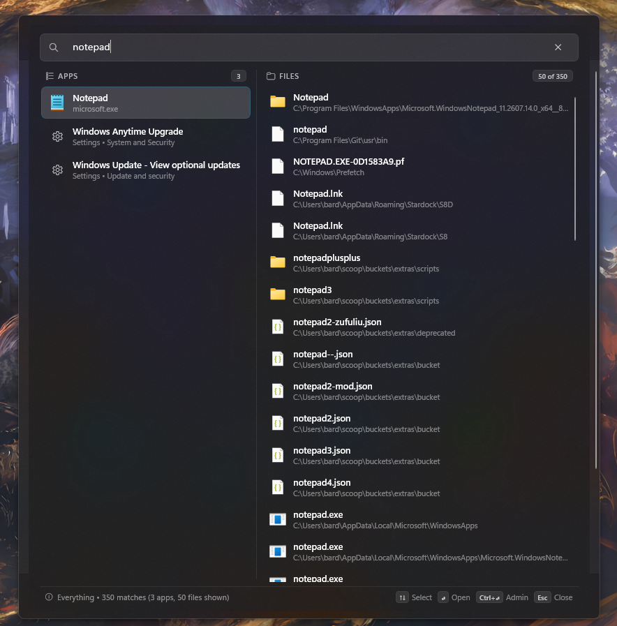
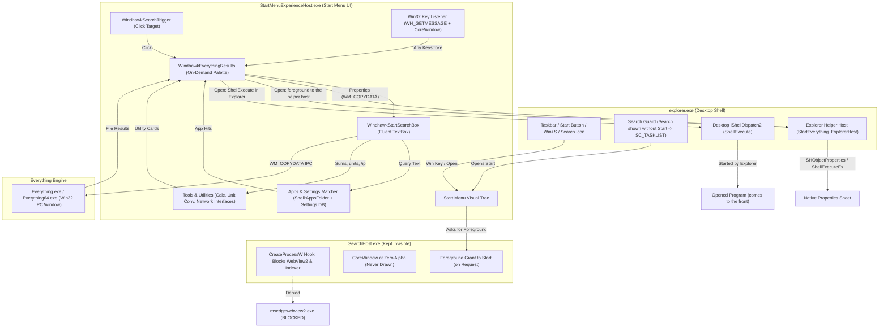

# Everything & Power Tools in the Start Menu

[](https://windhawk.net/)
[](https://www.voidtools.com/)
[](LICENSE)

A native replacement for Windows 11 Start Menu search, powered by voidtools Everything. Type in the Start Menu to search files, apps, and settings instantly. Windows Search stays out of the way: its window is never shown, and it cannot start the Edge WebView2 process behind its Bing-backed search panel. Win+S and the taskbar search icon open this search too.



---

## Highlights and Key Features

- **Instant voidtools Everything IPC**: Queries Everything directly through its Win32 IPC interface for fast results across millions of files. The mod keeps no index of its own.
- **Smart Apps and Windows Settings Search**: Instant fuzzy matching across Desktop applications, Microsoft Store / UWP packages, Control Panel applets, and Windows Settings URIs (`ms-settings:`), with sharp shell icons, made at the exact pixel size of your display.
- **Learns Your Favorites**: Apps you open from here more often move up among results that match equally well. A clearly better match always stays on top. Can be turned off in the settings, which also forgets what was learned.
- **On-Demand Animated Palette**: The Start Menu stays completely clean and uncluttered when idle. The search palette slides in with a short ease-out animation the moment you type or click the search box, and collapses when emptied or on Escape.
- **Windows Search Out of the Way**: `SearchHost.exe` keeps running for the shell, but its window is never shown and it cannot launch Edge WebView2, the web view behind its Bing-backed search panel.
- **Win+S and the Search Icon**: Win+S and the taskbar search icon open the Start Menu with this search instead of the Windows search panel.
- **Inline Calculator**: Type a sum (e.g. `100 * 5`, `sqrt(144)`, `15% of 200`, `2^10`) and the result shows above the apps; large and small results show in scientific notation too (`= 99000`, `= 9.9e4`). Press Enter to copy it.
- **Unit Converter**: Type `100 km` to see it in the usual units of its kind, all on one line first, or `100 km to mi` (also `in`, `->`, `=`) for just one; `255 hex` or `0xFF` for other bases. It knows length, mass, temperature, speed, area, volume, data, data rate, time, pressure, energy, power, angle and frequency, with `.` or `,` as the decimal point, and each kind has its color. A number alone, or one in a name (`2024 report`, `3d`), is left to the search. Add units it does not know in the settings, and have them convert back too (Reciprocal).
- **Network Interface Inspector**: Type `/ip` to display all active Wi-Fi, Ethernet, and VPN network interfaces with their IP addresses, subnet masks, gateways, and hardware descriptions. Press Enter to copy the IP.
- **Full Right-Click Context Menu**: Right-click any file, folder, or application to Open, Run as Administrator, Open in terminal, Properties, Create desktop shortcut, Cut/Copy (files), Copy path, Open file location, or Uninstall (apps).
- **Native Properties Dialogs**: Properties opens through `explorer.exe`, the same dialog as in File Explorer.
- **File Preview**: The selected file gets a preview card beside the Start Menu: a large thumbnail (the one File Explorer shows, so pictures, a frame of a video and documents; PDFs show their first page, drawn by Windows' own PDF renderer) with its size, date and, for pictures and videos, dimensions and length. Videos and animated GIF and WebP images play in it, muted, and a PDF turns through its first pages. SVG images are drawn by Windows' own renderer. A file with no picture shows the start of its text instead: a text or code file its first lines, and a Word, Excel, PowerPoint, RTF or OpenDocument file its first paragraphs, read by Windows' own document readers (no Office needed), or Office's when it is installed. These readers run inside Start, as File Explorer runs them in its preview pane. Below it, the details: type, size, dates, and what the kind of file has of its own (dimensions, length, artist and album, camera, a program's description and version, a document's title and author). A folder shows how many items it holds and, when Everything keeps folder sizes (its "Index folder size" option), its size. A click on the path copies it.
- **Drag and Drop**: Drag a file or folder from the results into File Explorer, the desktop or another app (Photoshop, a code editor, a chat) as you would from File Explorer. It is always a copy, never a move. Start closes once it has landed; Escape, or letting go over Start, cancels.
- **Uninstall**: Right-click an app and choose Uninstall. After a confirmation that names what goes, a Store app is removed as Start removes it, and a program runs its own uninstaller, the one Installed apps in Settings runs. Apps that are part of Windows offer none. A Store app is removed in the background, with no progress bar: it is gone from the list after a few seconds.
- **Opens in Front**: Programs are started by Explorer, the way the stock Start menu starts them, so they come to the front even when they take a while to start or you move the mouse meanwhile.
- **Explicit Web Search**: Trigger web searches on demand using the `?` prefix (e.g. `?query`). Includes customizable keyword shortcuts such as `?yt` (YouTube), `?gh` (GitHub), `?w` (Wikipedia), and `?r` (Reddit).
- **Start Menu Styler Compatibility**: Automatically adopts background styles (Tinted Glass, Acrylic, custom theme colors) in real time without needing to restart the mod.
- **No Input Injection**: Focus is handled with standard foreground APIs only; the mod never attaches thread input or synthesizes keystrokes.
- **Accidental Open Prevention**: Enter only triggers actions when an item is selected in the active panel, preventing unintended opening of files.

---

## System Architecture


```mermaid
graph TD
    subgraph Explorer_Process ["explorer.exe (Desktop Shell)"]
        T["Taskbar / Start Button / Win+S / Search Icon"]
        GUARD["Search Guard (Search shown without Start -> SC_TASKLIST)"]
        PROP["Explorer Helper Host (StartEverything_ExplorerHost)"]
        SHD["Desktop IShellDispatch2 (ShellExecute)"]
    end

    subgraph Start_Menu ["StartMenuExperienceHost.exe (Start Menu UI)"]
        SM["Start Menu Visual Tree"]
        TRIG["WindhawkSearchTrigger (Click Target)"]
        PAL["WindhawkEverythingResults (On-Demand Palette)"]
        BOX["WindhawkStartSearchBox (Fluent TextBox)"]
        KL["Win32 Key Listener (WH_GETMESSAGE + CoreWindow)"]
        APPS["Apps & Settings Matcher (Shell:AppsFolder + Settings DB)"]
        TOOLS["Tools & Utilities (Calc, Unit Conv, Network Interfaces)"]
    end

    subgraph Search_Host ["SearchHost.exe (Kept Invisible)"]
        WV_HOOK["CreateProcessW Hook: Blocks WebView2 & Indexer"]
        HIDE["CoreWindow at Zero Alpha (Never Drawn)"]
        GRANT["Foreground Grant to Start (on Request)"]
    end

    subgraph Everything_Engine ["Everything Engine"]
        EV["Everything.exe / Everything64.exe (Win32 IPC Window)"]
    end

    T -->|"Win Key / Open"| SM
    KL -->|"Any Keystroke"| PAL
    TRIG -->|"Click"| PAL
    PAL --> BOX
    BOX -->|"Query Text"| APPS
    BOX -->|"Sums, units, /ip"| TOOLS
    BOX -->|"WM_COPYDATA IPC"| EV
    EV -->|"File Results"| PAL
    APPS -->|"App Hits"| PAL
    TOOLS -->|"Utility Cards"| PAL

    GUARD -->|"Opens Start"| SM
    SM -->|"Asks for Foreground"| GRANT
    PAL -->|"Properties (WM_COPYDATA)"| PROP
    PROP -->|"SHObjectProperties / ShellExecuteEx"| DESK["Native Properties Sheet"]
    PAL -->|"Open: foreground to the helper host"| PROP
    PAL -->|"Open: ShellExecute in Explorer"| SHD
    SHD -->|"Started by Explorer"| PROG["Opened Program (comes to the front)"]

    WV_HOOK -.->|"Denied"| WV["msedgewebview2.exe (BLOCKED)"]
```

---

## Built-In Commands and Utilities

| Command | Description | Example | Enter Action |
| :--- | :--- | :--- | :--- |
| `<sum>` | Calculation | `100 * 5`<br>`sqrt(144)`<br>`15% of 200` | Copies the result |
| `<number> hex`, `0xFF`, `0b1010` | The number in other bases (digits grouped: `0b111 1111 1111`) | `2047 hex`<br>`0x7FF` | Copies the hex value |
| `<number> <unit>` | The number in the usual units of its kind, all on one line first | `100 km`<br>`32 f`<br>`1,5 kg` | Copies the selected one |
| `<number> <unit> to <unit>` | Just that conversion (also `in`, `->`, `=`) | `100 km to mi`<br>`100 mbps to MB/s` | Copies the result |
| `/ip` | Lists all active Wi-Fi, Ethernet, and VPN adapters with IP, subnet, gateway, and adapter name | `/ip` | Copies selected IP address to clipboard |
| `?<query>` | Searches the web using the default search engine URL | `?weather today` | Opens search in default web browser |
| `?<shortcut> <query>` | Searches specific service using configured shortcut keyword | `?yt lofi hip hop`<br>`?gh windhawk` | Opens query on target service |

---

## Keyboard Shortcuts and Navigation

| Shortcut / Input | Action |
| :--- | :--- |
| **Type any key** | Automatically reveals the search palette, focuses the search box, and queries apps and files |
| **Click Search Area** | Clicks header trigger area to reveal search palette and focus search box |
| **Up / Down Arrow Keys** | Navigate selection through applications, utility cards, and files |
| **Tab / Shift + Tab** | Move to the next / previous result, through the apps and on into the files |
| **Left / Right Arrow Keys** | Switch between the Apps and Files columns (Right only with the cursor at the end of the query, so the arrows still move the cursor while you edit) |
| **Enter** | Launch selected application, copy calculation/conversion/IP result, or open item. Pressed before the results for what you typed are in, it opens the first one as soon as they arrive |
| **Ctrl + Enter** | Run selected application or file as Administrator (triggers UAC) |
| **Shift + Enter** | Open the selected result's context menu (same as right-click); navigate it with the arrow keys and Enter |
| **Escape** | Clear search text and smoothly collapse search palette back to pinned apps |
| **Right-Click** | Open context menu (Open, Run as administrator, Open in terminal, Properties, Create desktop shortcut, Cut/Copy, Copy path, Open file location) |

---

## Right-Click Context Menu Actions

When right-clicking any file, folder, or application:

- **Open**: Opens the file or launches the application.
- **Run as administrator**: Launches executables, scripts (`.bat`, `.cmd`, `.ps1`), shortcuts (`.lnk`), and management consoles (`.msc`) with elevated administrative privileges.
- **Open in terminal**: *(Folders only)* Flyout submenu with options for **Command Prompt** and **PowerShell**:
  - Left-click launches normally in that folder.
  - Right-click launches elevated as Administrator in that folder.
- **Properties**: Displays the native Windows properties dialog sheet for the file, folder, or application via the Explorer Shell Relay host.
- **Open file location**: Opens the parent folder in File Explorer and selects the target item.
- **Copy path**: Copies the absolute file path as plain text (`CF_UNICODETEXT`). Does not close the Start Menu.
- **Create desktop shortcut**: Instantly creates a `.lnk` shortcut on the user's Desktop for files, folders, Win32 apps, or UWP packages. Existing shortcuts are never overwritten. Does not close the Start Menu.
- **Cut**: *(Files panel)* Places the file on the Windows clipboard using shell `CF_HDROP` with `DROPEFFECT_MOVE`. Pasting in any File Explorer folder or Desktop moves the file. Does not close the Start Menu.
- **Copy**: *(Files panel)* Places the file on the Windows clipboard using shell `CF_HDROP` with `DROPEFFECT_COPY`. Pasting in any File Explorer folder or Desktop duplicates the file. Does not close the Start Menu.
- **Uninstall**: *(Apps panel)* After a confirmation that names what goes, removes a Store app for your account, or runs a program's own uninstaller, the one Settings > Installed apps runs. Not offered for apps that are part of Windows or programs that registered no uninstaller.

> [!NOTE]
> **Pinning to Taskbar or Start Menu**:
> In modern Windows 11, Microsoft has strictly restricted programmatic pinning APIs (`Pin to Taskbar` / `Pin to Start`) to internal Windows system processes; third-party software cannot invoke these verbs directly.
> If you wish to pin an item from search results to your Taskbar or Start Menu:
> 1. Right-click the item and select **Create desktop shortcut**.
> 2. Go to your Desktop, right-click the newly created shortcut, and select **Pin to Taskbar** or **Pin to Start**.

---

## Mod Settings and Customization

All settings can be customized in the Windhawk UI under **Everything & Power Tools in the Start Menu** > **Settings**:

- **Max App Results**: Number of application matches displayed in the Apps column (default 6).
- **Max File Results**: Number of file matches displayed in the Files column (default 12).
- **Search Panel Margin**: Space in pixels between the search panel and the edges of the Start Menu (default 0, edge to edge; 14 gives the inset look of earlier versions).
- **Text Size (%)**: Size of the search panel's text, 80 to 150 percent of the usual (default 100).
- **Search Debounce Delay (ms)**: Extra delay before searching, to let typing settle (default 0, instant). Rarely needed: while a search runs, new keystrokes already wait and only the latest text is searched.
- **Learn Favorite Apps**: Rank the apps you open more often first among equally good matches (default on). Turning it off stops counting and forgets the apps learned so far; turn it on again to start over.
- **File Preview**: Show the preview card beside the Start Menu for the selected file (default on).
- **Play Videos and Animations**: In the preview, play videos and animated GIF and WebP images, muted and on a loop, and turn through a PDF's first pages, a second each (default on).
- **Show Keyboard Shortcuts Bar**: Toggle display of the bottom shortcuts hint bar.
- **Filter Noisy Paths**: Hide deep build caches, version control internals, and temporary directories from file results, unless nothing else matches.
- **Excluded Path Patterns**: Paths containing any of these substrings (e.g. `\node_modules\`, `\.git\`, `\build\intermediates\`, `\windows\winsxs\`) are treated the same way, so build artifacts and internal system files do not clutter results.
- **Default Search Engine URL**: URL template for web search queries (default DuckDuckGo: `https://duckduckgo.com/?q={q}`).
- **Web Search Shortcuts**: Define custom prefix keywords and target URLs (e.g. `yt` for YouTube, `gh` for GitHub, `w` for Wikipedia, `r` for Reddit).
- **Custom Unit Conversions**: Units the converter does not know already, item by item:
  - Formulas use `x` as the input number (e.g. `x / 16` for px to em).
  - **Reciprocal**: also convert back, from the target unit - for a linear formula (`a * x + b`), as a unit conversion is.
  - Delete individual conversions with the remove button on each item.
  - Add new conversion formulas at any time.

---

## How It Works Internally

### 1. High-Performance Win32 IPC
Rather than relying on COM search indexers or external broker daemons, the mod communicates directly with voidtools Everything's `EVERYTHING_IPC_WNDCLASS` hidden window via Win32 `WM_COPYDATA`, with results across millions of indexed files typically back in tens of milliseconds.

### 2. Windows Search, Kept Out of the Way
Windows gives `SearchHost.exe` the foreground whenever Start or Search opens, so the mod works with it rather than against it. Nothing about how the shell shows, hides, or activates it is blocked:
- `CreateProcessW`: Denies launching `msedgewebview2.exe` and `searchindexer.exe`, so its web view never starts.
- Its window is drawn at zero alpha, so it never appears and clicks pass through it.
- It grants the Start menu the foreground when the Start menu asks for it; the Start menu then takes it itself.

In `explorer.exe`, a guard watches public window events: whenever Search is showing while Start is closed and you are still on one of the two (Win+S, the taskbar search icon, or a key typed a few milliseconds after the Windows key), it opens the Start menu with the documented `WM_SYSCOMMAND` / `SC_TASKLIST` command. No keystrokes are injected, and nothing runs in Explorer's own foreground path.

### 3. Explorer Shell Property Relay
Properties dialogs are opened by `explorer.exe`, like in File Explorer. The mod creates a small STA host window there (`StartEverything_ExplorerHost`); when "Properties" is clicked in the Start Menu, the path is sent to it with `WM_COPYDATA`, checked (local and existing), and opened with `SHObjectProperties`.

### 4. Programs Started by Explorer
The Start menu's own `ShellExecute` is carried out for it by `sihost.exe`, so a program opened that way is not started by the foreground process, and Windows takes away its right to come to the front on the next keystroke or mouse move: a program slow to show its window opened behind the app you were in. Like the stock Start menu, the mod hands the foreground to Explorer (its `StartEverything_ExplorerHost` window) and has Explorer start the program, through the desktop's documented `IShellDispatch2::ShellExecute`. Apps are opened by their `shell:AppsFolder` name, so what their shortcut passes is kept. Run as administrator still goes straight to UAC.

### 5. File Preview
The card beside the Start menu is a XAML popup. Start's window covers the whole screen but draws only inside its window region (the menu), so the card's rectangle is added to that region while it shows and taken out when it goes. A thread of its own fetches the shell thumbnail and properties, renders PDF pages with `Windows.Data.Pdf`, reads the start of text files itself and of documents through Windows' or Office's own `IFilter`s, and asks Everything for a folder's size and item count. SVGs are drawn by XAML's `SvgImageSource`; videos play in a muted `MediaPlayerElement`.

### 6. Drag and Drop Through Explorer
XAML's own drag cannot run in Start's window, and a drag loop in Start's process never gets the mouse. So the drag runs in Explorer: Start hands the foreground to the mod's host window there, which runs the shell's `SHDoDragDrop` with the file's own shell data object, copy only. Windows keeps sending the mouse to Start while the button is held, so a small thread follows the pointer and feeds the drag loop its moves and the release.

### 7. Uninstall
A program runs the uninstaller it registered under `Software\Microsoft\Windows\CurrentVersion\Uninstall`, found by its program file, install folder or name, and started through Explorer. A Store app is removed with `PackageManager.RemovePackageAsync` in Explorer, which checks the request first: Start must be open and in front, must confirm it is asking for that package, and the package must not be part of Windows.

### 8. Dynamic Theme and Acrylic Synchronization
When using Windhawk's Windows 11 Start Menu Styler or custom system themes:
- **Visual Tree Re-attachment**: If Start Menu Styler reloads control templates, the mod automatically detects visual tree changes, cleans dangling references, and re-attaches the search palette to the active container.
- **Dynamic Background Sync**: `SyncOverlayBackground()` inspects `Border#AcrylicBorder` on every reveal, automatically syncing Tinted Glass, custom Acrylic, or themed brushes without requiring mod restarts.

---

## Requirements

1. **Windows 11**: Supports versions `22H2+` (x86-64).
2. **voidtools Everything**: Either **Everything 1.4** or **Everything 1.5** (alpha or beta, under any instance name) running in the background. Download from [https://www.voidtools.com/](https://www.voidtools.com/).
3. **Windhawk**: Download and install [Windhawk](https://windhawk.net/) (version 1.4 or newer).

---

## Taskbar Search

The Windows key, the Start button, Win+S, and the taskbar search icon all open this search. The full taskbar search box is not supported, so set Search to **Search icon only** or **Hide**:

1. Right-click an empty area on the Taskbar and select **Taskbar settings** (or navigate to **Settings** > **Personalization** > **Taskbar**).
2. Under **Taskbar items**, set **Search** to **Search icon only** or **Hide**.

---

## Building and Hot-Reloading

To compile and hot-reload the mod into your active Windows session:

1. Clone or copy this repository to your local drive (e.g. `D:\Work\start-search-everything`).
2. Open PowerShell as Administrator and run the automated build script:

```powershell
powershell.exe -ExecutionPolicy Bypass -File .\build_and_deploy.ps1
```

The script will:
- Compile `start-everything.wh.cpp` via Clang (`-std=c++23`, `-O2`).
- Register the binary DLL inside Windhawk's Engine directory (`C:\ProgramData\Windhawk\Engine\Mods\64\`).
- Synchronize mod source and settings into Windhawk.
- Recycle `StartMenuExperienceHost.exe` to inject the updated mod immediately.

---

## License

This project is licensed under the **GNU General Public License v3.0** (GPL-3.0). See [LICENSE](LICENSE) for details.
